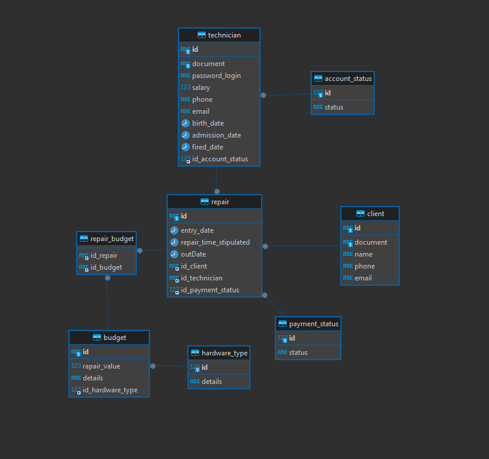

# SB's Tech
#### Aplicação para o gerenciamento de entradas e saídas de hardware em uma loja de manutenção de computadores e hardware em geral
## O diagrama de entidade relacionamento

## Endpoints
- GET v1/clients/{id}
- GET v1/clients?document
- POST v1/clients
- PUT v1/clients/{id}
- DELETE v1/clients/{id}
- GET v1/technician/{id}
- GET v1/technician?document
- POST v1/technician
- PUT v1/technician/{id}
- DELETE v1/technician/{id}
- GET v1/repair/client?document
- GET v1/repair/technician?document
- POST v1/repair
- PUT v1/repair/{id}
- PUT v1/repair/{id}/budget
- DELETE v1/repair/{id}
## Etapas
- ~~Criar base de dados MySQL em um container Docker;~~
- ~~Extrair modelo ER do SGDB MySQL;~~
- Criar as camadas de entidades, acesso ao banco de dados, serviços, controllers, testes, etc;
- Implementar cacheamento com Redis;
- Implementar Autenticação e Autorização com JWT;
- Documentar com Swagger;
- Adicionar a aplicação em um container docker e subir no dockerhub. 